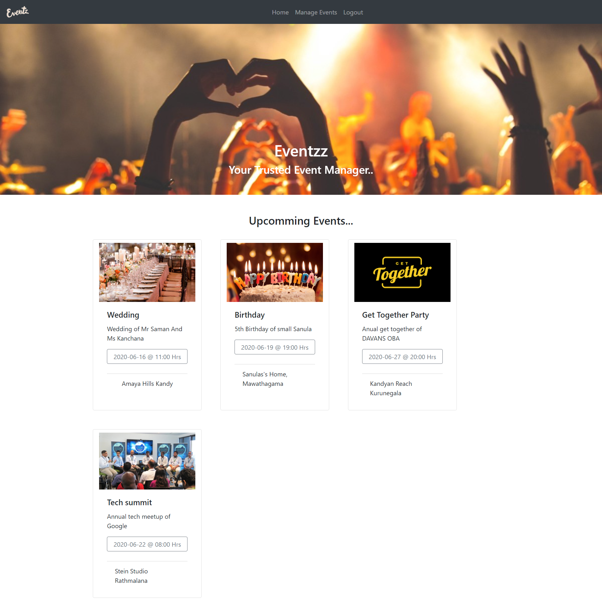

# Event-Management-System
A simple event management system build using MERN that has CRUD and Login

Follow these steps to deploy the application in your machine.

1.	Clone/Download the project from the GitHub Repository.

        •	Front-end	  
        •	Back-end     

2.	Install required dependencies separately in both front-end and back-end.

        •	npm install

3.	Start the Back end

        •	node index.js

4.	Start the Front end

        •	npm start

5.	Now your application runs in http://localhost:3000/ URL.

